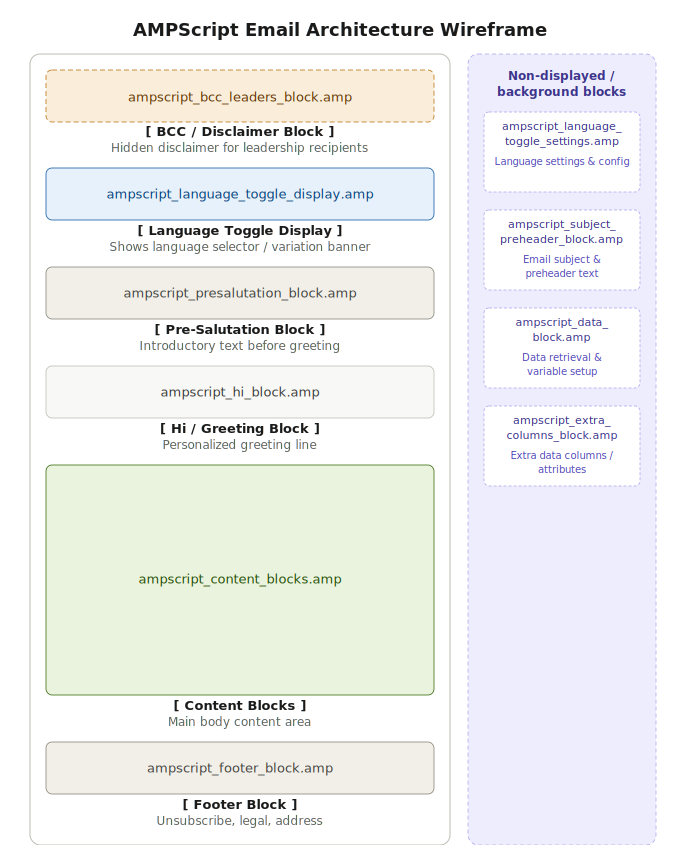

# AMPScript Code - Salesforce Marketing Cloud Email Templates

This folder contains production-ready AMPScript code blocks used in Salesforce Marketing Cloud Engagement (SFMCE) email templates. These blocks handle dynamic personalization, multilingual content delivery, data processing, and responsive email rendering.

## Overview

AMPScript is Salesforce Marketing Cloud's proprietary personalization language that allows for dynamic content manipulation within email templates. The blocks in this folder are designed to be modular and reusable across multiple email campaigns.

---

## Placement in Email

AMPScript blocks are organized so that background configuration and data-initialization blocks execute first (they do not render but set variables), followed by header and preheader initialization, then pre-salutation and greeting blocks, the main content blocks, and finally the footer. This ordering ensures variables and language settings are available when content blocks render and that non-displayed blocks (settings, subject/preheader, data load) run safely in the template background.

## File Descriptions

Below are the AMPScript blocks in this folder grouped by purpose. Each entry is a direct link to the file followed by a one-line description (no tables).

### Language & Localization

- [ampscript_language_toggle_settings.amp](ampscript_language_toggle_settings.amp) - Language configuration and initialization block: manages 22+ language toggles, locale-specific date formats, PDF content names, and sets global variables such as `@langShortName`, `@languageCode`, and `@languageLocalFormat` with English as the fallback.
- [ampscript_language_toggle_display.amp](ampscript_language_toggle_display.amp) - Language selection UI renderer: outputs clickable language links for supported locales, builds RedirectTo URLs for language-specific PDF assets, and uses HTML entities to ensure correct international character rendering.

### Data & Configuration

- [ampscript_data_block.amp](ampscript_data_block.amp) - Subscriber and campaign data initializer: reads subscriber attributes (e.g., `@firstName`, device type), normalizes values (ProperCase), and defines baseline variables consumed across templates and blocks.
- [ampscript_extra_columns_block.amp](ampscript_extra_columns_block.amp) - JSON extra-columns parser: safely parses the `ExtraColumns` JSON attribute, extracts fields such as `SoftphoneNumber`, `Buddy`, and `Conference`, and maps them to template variables with graceful handling for missing keys.

### Content Retrieval

- [ampscript_body_blocks_loop.amp](ampscript_body_blocks_loop.amp) - Campaign path and header content loader: sets `@subPath` and `@campaignName`, then retrieves language-specific subject lines and preheaders from Content Builder with an automatic English fallback.
- [ampscript_content_blocks.amp](ampscript_content_blocks.amp) - Dynamic P-block retriever: loops numbered content blocks (P1..Pn), fetches language-specific HTML/text for each block from Content Builder, and falls back to English when translations are absent.
- [ampscript_footer_block.amp](ampscript_footer_block.amp) - Legal footer fetcher: retrieves localized legal and compliance text from Content Builder and ensures a reliable English fallback for missing translations.
- [ampscript_presalutation_block.amp](ampscript_presalutation_block.amp) - Pre-salutation content loader: pulls language-specific introductory copy that appears before the main greeting, with fallback behavior for absent translations.

### Email Structure & Display

- [ampscript_hi_block_raw.amp](ampscript_hi_block_raw.amp) - Plain-text greeting block: simple `Hello [First Name]` substitution using AMPScript variables for lightweight, text-only messages.
- [ampscript_hi_block.amp](ampscript_hi_block.amp) - Formatted greeting block: renders the subscriber name within a responsive HTML table structure and inserts language-specific greeting content pulled from Content Builder.
- [ampscript_subject_preheader_block.amp](ampscript_subject_preheader_block.amp) - Subject and preheader initializer: sets the `@subject` and preview text used by email clients and can include dynamic banner messaging for the header area.
- [ampscript_bcc_leaders_block.amp](ampscript_bcc_leaders_block.amp) - BCC / leadership handling block: detects leadership or BCC send types, prepends subject prefixes when needed, and conditionally renders a management notification block with contact information.

### Multilingual Support
- 22+ supported languages with individual enable/disable flags
- Automatic English fallback for missing translations
- HTML entity encoding for international character compatibility with email service providers
- Locale-specific date formatting for each language region

### Content Builder Integration
- Dynamic content retrieval using folder path structure
- Language-based content organization: `/basePath/subPath/[LanguageCode]/`
- Numbered content blocks (P1, P2, P3, etc.) for campaign-specific messaging
- Flexible content inheritance with fallback mechanisms

### Responsive Design
- HTML tables with proper structure for email client compatibility
- Supported by major ESPs (Salesforce SFMC, HubSpot, Marketo, etc.)
- Mobile-friendly responsive design patterns

### Data Processing
- JSON parsing for complex attribute data
- Subscriber attribute extraction and formatting
- Safe field handling with graceful degradation

---

## Variable Dependencies

### Global Variables (Set in Language Settings)
- `@langShortName` - Language code (EN, DE, FR, ES, IT, PT, JA, KO, ZH, etc.)
- `@languageCode` - Locale code (en-US, de-DE, fr-FR, etc.)
- `@languageLocalFormat` - Language-specific date format pattern

### Global Variables (Set in Data Block)
- `@firstName` - Subscriber first name (formatted with ProperCase)
- `@deviceType` - Type of device/equipment
- `@wave` - Campaign wave/stage information

### Global Variables (Set in Body Blocks Loop)
- `@subPath` - Campaign subfolder path
- `@campaignName` - Campaign identifier
- `@subject` - Email subject line

### Output Variables
- `@preSalutation` - Pre-greeting content
- `@hiContent` - Greeting content
- `@LegalFooter` - Footer/legal content
- `@migrationDate` - Formatted date
- Various language-specific variables for toggles and PDF names

---

## Best Practices

1. **Always Set Variables First** - Ensure language and data blocks execute before content retrieval blocks
2. **Use Fallbacks** - ContentBlockByName always includes English fallback as last parameter
3. **PII Protection** - Replace specific names/emails with generic placeholders in production
4. **Test Locales** - Verify date formatting and special characters render correctly in target email clients
5. **Monitor Performance** - Nested ContentBlockByName calls can impact template rendering time; cache when possible

---

## Last Updated
December 2025