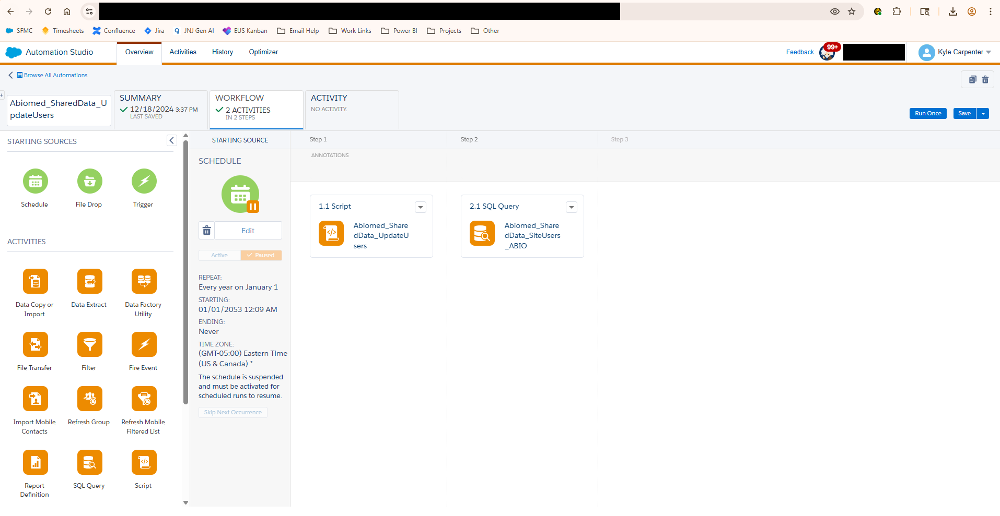
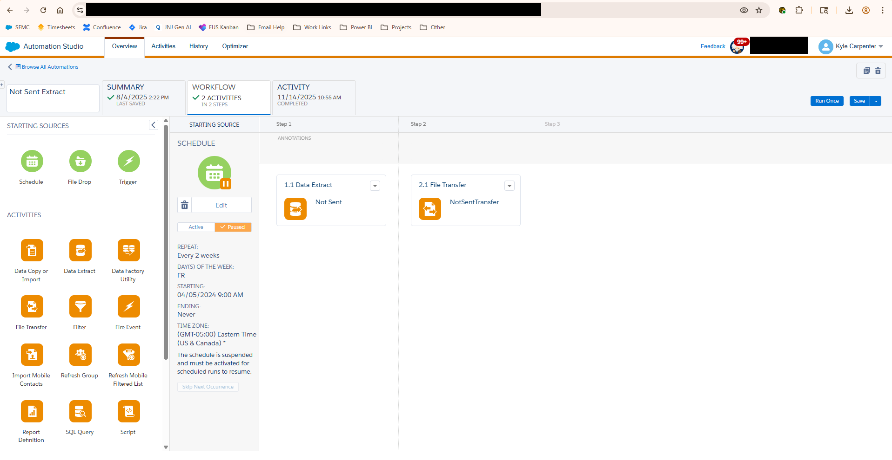
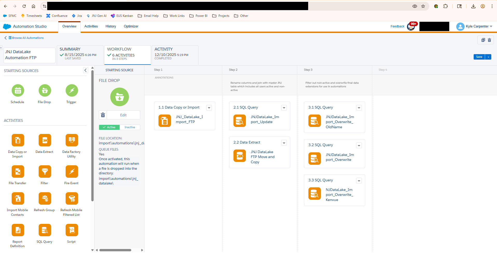
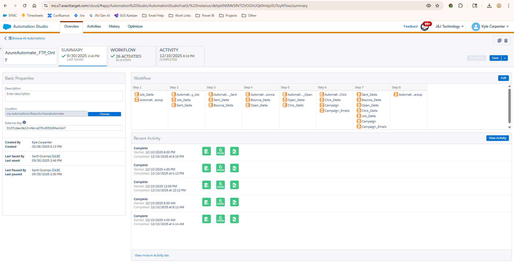

# Automation Studio Documentation

## Table of Contents
- [Overview](#overview)
- [Importance and Business Use Cases](#importance-and-business-use-cases)
- [Architecture Diagrams](#architecture-diagrams)
- [Automation Examples](#automation-examples)
- [About These Examples](#about-these-examples)

## Overview

This folder contains visual documentation and architecture diagrams demonstrating Salesforce Marketing Cloud (SFMC) Automation Studio workflows, including data integrations with Azure services, automated exports, and data processing pipelines.

## Importance and Business Use Cases

- **Automated Data Integration**: Streamlines data flow between SFMC and Azure for centralized reporting and analytics
- **Scheduled Data Exports**: Enables regular extraction of marketing data views to external systems for backup and analysis
- **Real-time Data Ingestion**: Facilitates automated import of external data sources into SFMC for campaign personalization
- **Business Intelligence**: Supports Power BI dashboards by maintaining up-to-date data pipelines from marketing activities
- **Operational Efficiency**: Reduces manual data handling through automated file transfers and processing
- **Compliance and Auditing**: Maintains data flow documentation for regulatory requirements and process validation
- **Scalable Architecture**: Demonstrates enterprise-level integration patterns that can handle high-volume data operations

## Architecture Diagrams

### SFMC - Azure - PowerBI Reporting Integration

**Purpose**: Comprehensive architecture diagram showing the end-to-end data flow from Salesforce Marketing Cloud through Azure Data Factory to Power BI dashboards.

**Key Components**:
- Salesforce Marketing Cloud automation (8-hour delta updates)
- Azure Data Factory processing pipeline
- Azure SQL Database (Datalake) storage
- Power BI visualization layer

[View Image](./docs/SFMC%20-%20Azure%20-%20PowerBI%20Reporting%20Integration.png)

---

## Automation Examples

### SFMC Automation Script Example (Abiomed)

**Purpose**: Demonstrates a complete Automation Studio workflow configuration for a specific client implementation.

**Key Features**:
- Multi-step automation sequence
- Script activity configuration
- Workflow scheduling and triggers

[View Image](./docs/sfmc_auto_script_example_abiomed.png)

---

### SFMC Export Not Sent List

**Purpose**: Shows automation configuration for exporting subscribers who were not sent an email, useful for suppression list management and deliverability analysis.

**Key Features**:
- Data extract activity setup
- File transfer configuration
- Destination settings

[View Image](./docs/sfmc_auto_sfmc_export_notsentlist.png)

---

### SFMC Input Data from Azure SFTP

**Purpose**: Illustrates the automation workflow for importing data files from Azure SFTP server into SFMC data extensions.

**Key Features**:
- File transfer activity from external source
- Data import mapping
- Automation scheduling configuration

[View Image](./docs/sfmc_auto_sfmc_input_data_from_azure_sftp.png)

---

### SFMC Output DataViews to Azure

**Purpose**: Demonstrates the automation workflow for extracting SFMC system data views (tracking data) and transferring them to Azure storage.

**Key Features**:
- Data extract activity for system data views
- File naming conventions and formatting
- Scheduled export to Azure blob storage
- Support for tracking data (opens, clicks, bounces, etc.)

[View Image](./docs/sfmc_auto_sfmc_output_dataviews_azure.png)

---

## About These Examples

These diagrams and screenshots represent actual automation workflows and integration architectures implemented in enterprise marketing operations. They demonstrate real-world solutions for:

- Connecting marketing platforms with cloud data services
- Automating data synchronization across systems
- Building scalable reporting infrastructure
- Maintaining data governance and compliance standards

All examples have been generalized to remove proprietary information while preserving the technical implementation details and architectural patterns.

---

**Last updated: 2026-01-06**
